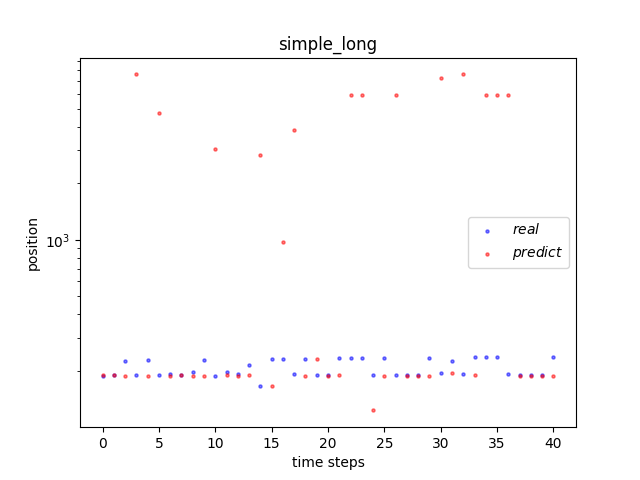
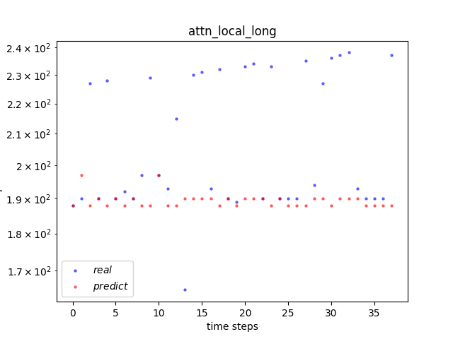

# ReimplementationOfTwoPapers. 
## Overview
- This repo aims to reimplement [Deepmove](https://github.com/vonfeng/DeepMove) and [MobilityUpperBoundPrediction](https://github.com/gavin-s-smith/MobilityPredictabilityUpperBounds) project using another framework or pure Python.

- Weekly summary will be uploaded in [weekly_summary](./weekly_summary) folder.

    - [week1 summary](./weekly_summary/week1.md)
    - [week2 summary](./weekly_summary/week2.md)
    - [week3 summary](./weekly_summary/week3.md)
    - [week4 summary](./weekly_summary/week4.md)
    - [week5 summary](./weekly_summary/week5.md)

- You can find the report [here](https://www.overleaf.com/4852345815swbgnvbfpbqk).
## Results
------------------------
- ### Deepmove
    I got these results from reimplemented tensorflow models as follows.  
       

    |model_mode|L2|attn_type|clip|dropout|hidden_size|learning_rate|loc_size|rnn_type|tim_size|uid_size|original_acc|my_acc|
    |:---:|:---:|:---:|:---:|:---:|:---:|:---:|:---:|:---:|:---:|:---:|:---:|:---:|
    |markov|||||||||||0.082|0.082|
    |simple|1.00E-06|dot|5|0.3|500|0.0001|500|LSTM|10|40|0.09587167|0.082337454|
    |simple_long|1.00E-05|dot|5|0.5|200|0.0007|500|LSTM|10|40|0.117923069|0.082788173|
    |attn_avg_long_user|1.00E-05|dot|5|0.2|300|0.0007|100|LSTM|10|40|0.133689175|0.135096371|
    |attn_local_long|1.00E-06|dot|2|0.6|300|0.0001|300|LSTM|20|40|0.145342384|0.150585050|

     Besides, I also plot user 4's predicted and real trajactory under four different models using [matplotlib](https://matplotlib.org/).

    

    
     
    

    

    
     
    

     You can find my results in [this folder](./codes/DeepMove/results).
----------------
- ### MobilityUpperBoundPrediction

    Original results

    

        
        
        
    

    <!--    -->

    My results
    

        
        
        
    

    <!--    -->

    You can find more details in [this folder](./codes/MobilityPrediction/LoPpercom/ResultsLoP_replication/).

--------
- ### Cross dataset test
    First, I applied DeepMove dataset to MobPrediction algorithm, and got the following table.

    || training set|
    |:---:|:---:|
    |number of failed personIDs|355|
    |possibility using DL method|0.4857|
    |possibility using RL method|0.3307|

    Which means we may achieve better results for trajactory prediction if using another algorithm rather than DeepMove algorithm.

    Then, I applied two datasets from DataGeolife , namely, spatial resolution 40.54km^2 with temporal resolution 0:05:00 (dataset1) and spatial resolution 618m^2 with temporal resolution 1:00:00 (dataset2) to DeepMove algorithm. Then I got the following table.

    ||dataset1|dataset2|
    |:---:|:---:|:---:|
    |possibility using DL method|0.9765|0.6201|
    |possibility using RL method|0.9688|0.2726|
    |possibility using DeepMove|0.7257|0.1013|

    It seems DeepMove doesn't have a very precise prediction.

    
<!--  -->

