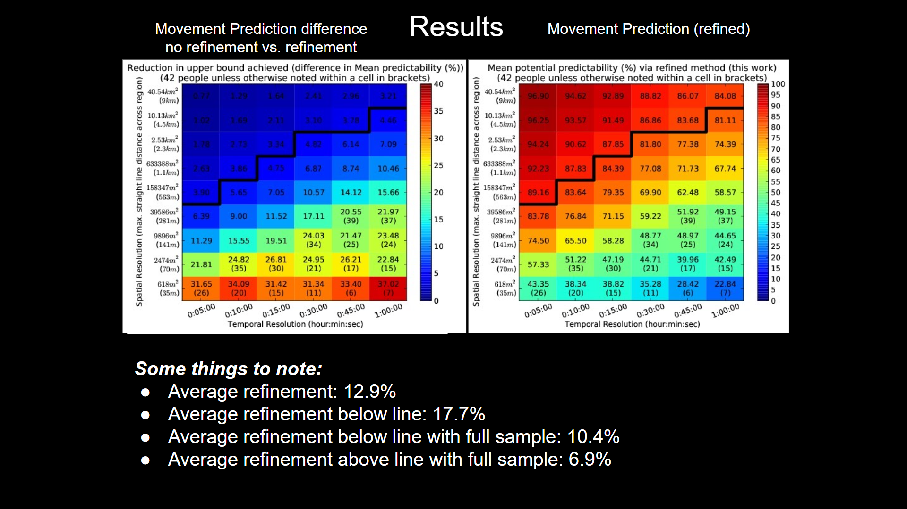
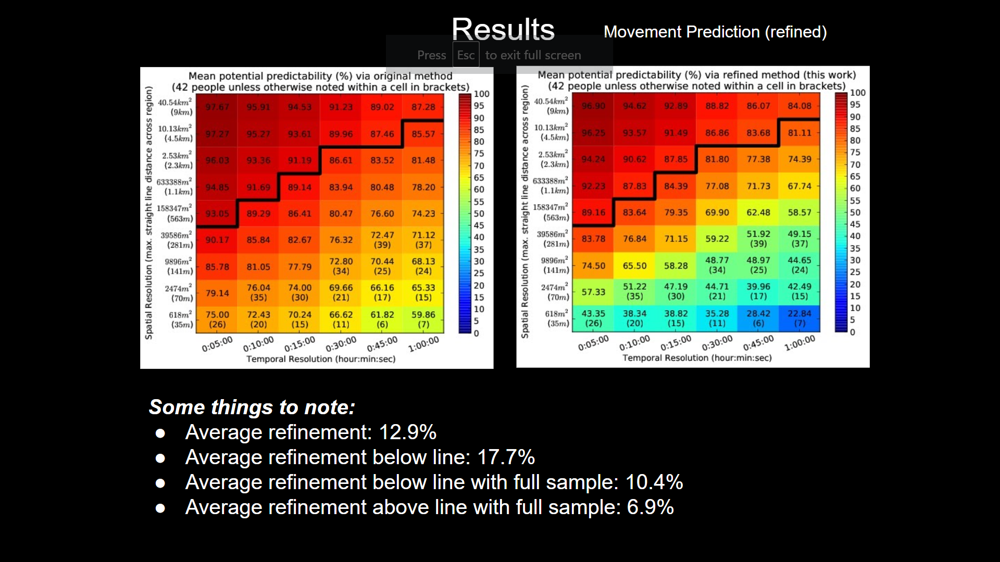

# Week5 Summary
 ##  DeepMove
### Components
### sorry i don't have figures for comparsion of original and predicted trajectory now
Here I implement three *.py file, namely:

- [model_tf.py](../codes/DeepMove/codes/model_tf.py)
- [train_tf.py](../codes/DeepMove/codes/train_tf.py)
- [main_tf.py](../codes/DeepMove/codes/main_tf.py)  

    
1\. **model_tf.py** is to store different models for training and test. There are differnt model may contain different parameters, such as loc, tim, history...
 ```python
    model_modes = ['simple', 'simple_long', 'attn_avg_long_user', 'attn_local_long']
 ```  
    
2\. **train_tf.py** create some functions to ouput the training set and test set according to our need.
Besides, it defines a training function.

3\. **main_tf.py** is to train the specified model from model_tf.py with variable parameters. If we are satisfied with the model, we could store it as a pretrained-model.  

### The whole logic

The code starts from ```run(args)``` in **main_tf.py**, first initilizes parameters(dict) for model and trainning. Then according to parameters.model_modes, we choose corresponding model.   

Afterwards, we use ```generate_input_history``` from **train_tf.py** . ```generate_input_history``` takes ```(parameters.data_neural, 'train' or 'test', parameters.history_mode, candidate)``` as inputs. 
- The first parameters.data_neural is whole data we get, it's actually a nested dict. And we need to extract useful data from it. 
- About the second parameter,  if we are going to get training set, we use ```'train'``` as the second parameter, vice versa for test set. 
- The last parameter candidate is the keys of parameters.data_neural. candidate is actually a list, which indicates the ids of users.  

The output is data_train(or data_test), train_idx(or test_idx)
- The structrue of data_train(or data_test) is like this: ```data_train[user][id] = trace```. trace is user's id-th trace, which is composed of information about location, time...
- id(dict) for training or test. ```id.keys()``` is more important than ```id.values()```.
  
Then we use these variables to generate speficifed training set and test set using ```generator_xxx(with regard to model_mode)```. As the name indicates, it is a genator. Since our inputs are with variable length, so we have to use a python generator to give model input. We can alternatively use another tensorflow session.

About the model, there are four tensorflow subclass models. For a given input(loc, tim, uid...), it would output a preidct trajectory.

Got the above done, we can start training a model using ```run_simple_mod```. It takes training set or test set as main input, train or test while calulating loss and accuracy. If we train a model, it will also return the updated model.  

For one epoch, we run ```run_simple_mod``` once, so train the model one time and save the temporary model. We have two criterions when changing learning rate.

Every time decreasing learning rate, we load the termporary best model into code and work on it. When the iteration is over, we choose the one with highest accuray and save related parameters. 

### Need to implement further  
visiualization

##  Mobility Prediction

main -> GeolifeEntropy.py  
getdata -> PLT -> Line 1...6 are useless in this dataset, and can be ignored. Points are described in following lines, one for each line.  
 - Field 1: Latitude in decimal degrees.  
  -  Field 2: Longitude in decimal degrees.  
   - Field 3: All set to 0 for this dataset.  
   - Field 4: Altitude in feet (-777 if not valid).  
   - Field 5: Date - number of days (with fractional part) that have passed since 12/30/1899.  
   - Field 6: Date as a string.  
   - Field 7: Time as a string.  

one person has a unique id and have many points -> calculate trajectory
  
empiricalEntropyRate -> according to trajectory, calcultate empirical entropy loss -> get the number of maximum reachable place/ distinct place -> calculate failed_id according to the solution of the equation -> use successful ones tocalculate probabilty
  
My Result
[Standrad Method](../codes/MobilityPrediction/LoPpercom/ResultsLoP_replication/final_graphs/Heatmap_DL42.pdf)  
[Refined Method](../codes/MobilityPrediction/LoPpercom/ResultsLoP_replication/final_graphs/Heatmap_RL42.pdf)  
[The difference](../codes/MobilityPrediction/LoPpercom/ResultsLoP_replication/final_graphs/Heatmap_DL42mRL42.pdf)  
Original Result
  

